The router lifecycle describes how navigation is intercepted, fetched, animated,
and finalized.

## Lifecycle flow

```mermaid
flowchart LR
  clickLink[ClickOrPopstate] --> validateLink[EligibilityCheck]
  validateLink --> updateHistory[HistoryPushOrPop]
  updateHistory --> fetchPage[FetchOrCacheNextPage]
  fetchPage --> parseContainer[ParseContainerAndDataset]
  parseContainer --> resolveTransition[ResolveTransitionRules]
  resolveTransition --> runTransition[RunHooksAndTransition]
  runTransition --> cleanupDom[RemoveOldContainer]
  cleanupDom --> emitEvents[EmitnewPageReadyAndtransitionCompleted]
```

## Event order

1. `initStateChange`
2. `newPageReady`
3. `transitionCompleted`

## Sequential vs sync mode

- `sync: false` (default): leave then enter.
- `sync: true`: leave and enter run together (`Promise.all`).

## Container behavior

During navigation, `router-view` may temporarily contain both old and new
containers. At finalize, old nodes are removed and only the active container
remains.
